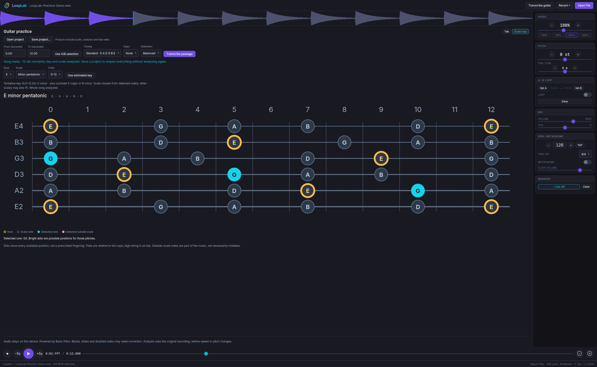
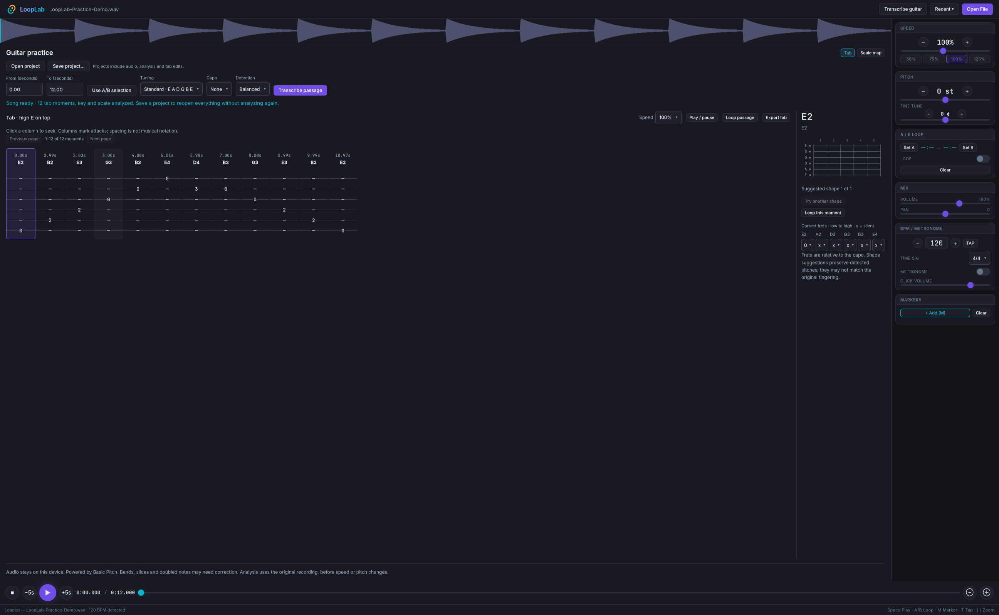

# LoopLab

A guitar practice player with pitch-preserving slowdown, A/B loops, automatic guitar tab and scale analysis, and portable projects. Analysis runs locally on your device.

## Screenshots

Scale map with estimated key and highlighted note positions:



Editable tab with suggested guitar fingering:



Screenshots show the app analyzing an original generated practice recording.

## License

LoopLab uses the custom [LoopLab Free Distribution License](LICENSE). You may use, modify, and share it for free. Selling it or incorporating its code into a paid application, subscription, or paid tier requires separate written permission. Distributed modifications must include source code under the same license. Using LoopLab for paid teaching, performances, or music production is allowed.

This is source-available software, not GPL-licensed or unrestricted open-source software. Third-party components retain their own licenses.

## Acknowledgments

Special thanks to **Jarrod Pyne**, my mentor and teacher in the early days, for his help and guidance.

Created by Matt Hoffer at Adroited LLC.

## Run

```sh
npm ci
npm run dev
```

Use Node.js 22 or newer. For desktop development, install Rust and the platform prerequisites for Tauri 2 (including WebKitGTK 4.1 on Linux), then run `npm run tauri dev`. Frontend build: `npm run build`.

### Windows x64

LoopLab uses Microsoft Edge WebView2 on Windows. The per-user NSIS installer includes the WebView2 bootstrapper, which installs the runtime if needed (an internet connection is required for that step). The installer is currently unsigned.

To build on Windows, install Node.js 22 or newer, Rust with the `x86_64-pc-windows-msvc` toolchain, and Visual Studio Build Tools with **Desktop development with C++** and a Windows SDK. Open PowerShell as your normal Windows user in the checkout and run:

```powershell
powershell -ExecutionPolicy Bypass -File scripts/build-windows.ps1
```

The script installs locked dependencies, runs the regression tests, and builds an installer in `src-tauri/target/x86_64-pc-windows-msvc/release/bundle/nsis/`. You can also run `npm run build:windows` for a build using your default Rust target. The Linux AppImage patch script is not used on Windows.

### Linux AppImage

The packaging helper targets Fedora x86_64 with WebKitGTK 4.1 installed:

```sh
APPIMAGE_EXTRACT_AND_RUN=1 NO_STRIP=1 npm run tauri build -- --bundles appimage
APPIMAGE_EXTRACT_AND_RUN=1 bash patch-appimage.sh src-tauri/target/release/bundle/appimage/LoopLab_0.4.0_amd64.AppImage
```

The patched result is `src-tauri/target/release/bundle/appimage/LoopLab-x86_64.AppImage`. Copy it to your preferred location and optionally run `bash install-desktop.sh /path/to/LoopLab-x86_64.AppImage` to register a desktop launcher.
Audio and guitar-logic regression tests: `npm test`.

## Transcribe a guitar passage

1. Open a recording and select an A/B range, or seek to the passage you want.
2. Use the transcription workspace directly below the compact waveform. Set the start and end (0.2–30 seconds), tuning, and capo.
3. Click **Transcribe passage**. Detection runs on this device in a cancellable worker. The model is bundled with the app; no account or audio upload is needed.
4. Switch to **Tab**. Click a tab column to seek. Use **Try another shape** for a different string assignment, or correct individual frets. Frets are relative to the capo; `x` means a silent string.
5. Use **Loop passage** or **Loop this moment**, and select a practice speed.
6. **Export tab** saves a text copy of your corrections before closing or loading another recording. Use **Save project…** to retain the editable analysis across app restarts.

Standard tuning and Drop D are supported, with capo 0–12. The model analyzes the original audio, not the pitch-shifted/slowed output. Chord names summarize the detected pitch classes; an arpeggio with ringing notes can appear as a chord. Tab columns are attacks with timestamps, not engraved rhythm notation. Exact unisons on multiple strings, bends, slides, distortion and other instruments are not reliably resolved. Start with short, clean, isolated guitar passages and use the result as an editable draft.

Fingerings preserve detected pitches and prefer smaller fret spans, open strings and less movement from the preceding shape. If no assignment fits the constraints, the UI shows `?` and lets you enter a fingering rather than silently changing pitches.

## Scale map

The workspace starts with **E minor pentatonic** (E, G, A, B, D). Select **12–24** in Frets for the familiar twelfth-fret box, or use the open-position map. Gold outlines mark roots. Choose any root, minor/major pentatonic, natural minor, major, or minor blues. Tuning and capo also apply to the map.

Opening a song automatically starts local analysis: an eight-second opening section gives the first result, then bounded chunks continue through the whole recording. Playback remains available. Progress and analyzed coverage are shown; notes only highlight where analysis has finished. Long recordings can take several minutes. Cancel stops background work and keeps partial results. Reopen the song to restart, or transcribe a short passage manually for tab.

The app estimates key from detected pitches weighted by duration and strength, and chooses pentatonic, full major/minor, or minor blues based on sustained characteristic notes. These are best-fit practice suggestions, not definitive scale labels. The estimate improves as more audio is analyzed. No song database or audio upload is involved. Changing Root or Scale preserves your manual choice during analysis; **Use estimated key** restores automatic selection. A newly loaded song starts automatic selection again.

Cyan dots show possible positions for detected pitches; pink retains notes outside the chosen scale. The map stays visible during rests and beyond analyzed coverage. Dots represent possible placements, not simultaneous fingering. Tab is generated alongside scale analysis for the whole recording. You can also replace the result by transcribing a selected passage. Its manual corrections and playback pitch changes do not alter the original detected pitches.

The estimator uses Krumhansl–Kessler profiles and correlation, as documented in [music21's key-analysis implementation](https://music21.org/music21docs/_modules/music21/analysis/discrete.html). Scale maps and key estimates are practice aids, not a guarantee that every note in a recording belongs to one scale.

## Save and reopen a project

1. Open a song and let automatic analysis finish. **Song ready** means tab, key, and scale data cover the whole recording. You can practice during analysis, or wait until it is all prepared.
2. Make any tab corrections and choose a scale or fingering. Earlier tab edits survive later background analysis chunks.
3. Click **Save project…**. The portable `.looplab` file contains the original audio bytes, detected notes and timing, key estimate and alternatives, scale/root/fret-range choice, tuning/capo/detection settings, tab shapes and edits, selected moment/view, and practice speed.
4. Click **Open project** (or drop a `.looplab` file on the app). Audio and saved results load together without running transcription again. No original recording path or database is required.
5. Save again after making changes. Saving while analysis is running creates a partial snapshot; the project displays analyzed coverage when reopened. Partial projects do not resume analysis automatically. Reopen the original audio to start a fresh whole-song pass.

Project saving is explicit, not autosave. Save before replacing a recording or closing the app. Projects bundle the recording and are consequently about the size of the original audio plus analysis. They preserve the guitar analysis workspace; loop points, markers, metronome, and pitch/mix controls are not stored in this version. **Export tab** still exports every tab moment as plain text, including edits. Long tab results use pages of 100 moments; playback follows the appropriate page.

The versioned project container validates analysis fields, audio length, and a SHA-256 audio checksum before loading. Unsupported versions and damaged files produce an error instead of silently applying mismatched analysis.

## Third-party components

Vendored SoundTouchJS code retains its LGPL-2.1-or-later license. The Basic Pitch model retains its Apache-2.0 license. See [THIRD_PARTY_NOTICES.md](THIRD_PARTY_NOTICES.md) for attribution and license locations.

## Model attribution

Transcription uses [Spotify Basic Pitch](https://github.com/spotify/basic-pitch-ts), version 1.0.1, under Apache-2.0. Unmodified model files and their license are in `public/models/basic-pitch/`. Basic Pitch and TensorFlow.js are loaded by the transcription worker when requested, not by the audio playback engine.

## Verification

The regression suite covers audio output duration, preserved pitch, loops, end-of-file notes, legal guitar fingerings, tuning/capo, strummed-note grouping and tab export. Browser checks include the local Enter Sandman MP3, editing a suggested shape, looping, and range validation. These checks validate the workflow, not note-for-note accuracy against a reference transcription.

The right-hand practice controls and bottom transport remain available while transcribing. Menus use application-rendered dark popups for consistent behavior on Linux.
